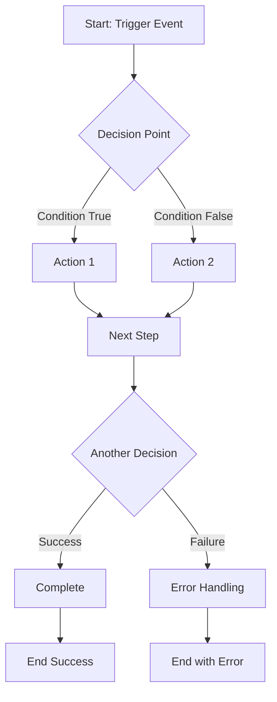
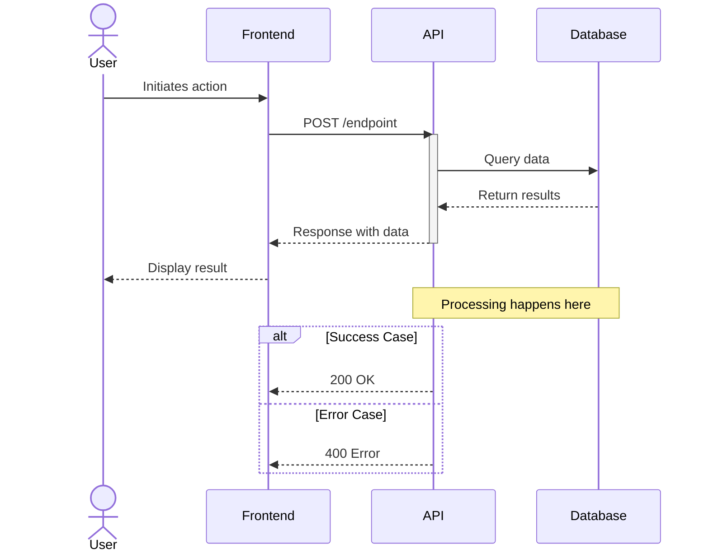
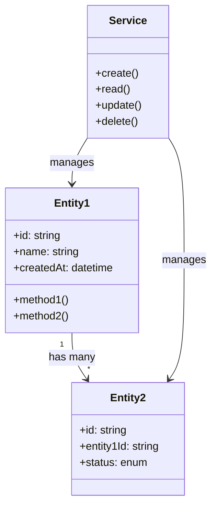
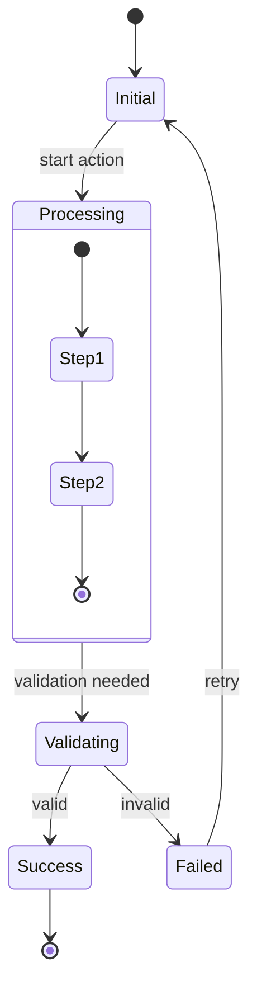
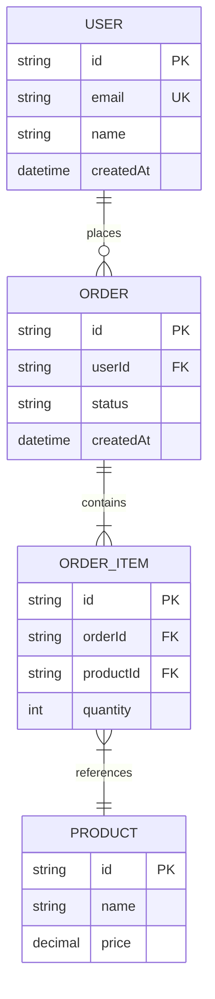

# Generate Feature Diagrams

Generate Mermaid diagrams to visualize architecture, flows, and relationships from feature specifications.

## Feature: $ARGUMENTS

## Feature Selection

1. **IF a feature name is provided in `$ARGUMENTS`**:
   - Find a directory in `features/` that matches `$ARGUMENTS`
   - If no exact match, search for closest match and ask for confirmation

2. **IF no feature name is provided**:
   - List all directories under `features/`
   - If only one exists, select it automatically
   - If multiple exist, ask user to specify using `AskUserQuestion`

## Your Task

Generate Mermaid diagrams that visualize the feature's architecture and flows based on its specification.

## Process

### Step 1: Load Feature Context

Read the specification files:
- `features/[feature-name]/context.md`
- `features/[feature-name]/requirements.md`

Extract key information:
- **Components**: From Technical Decisions and Architecture sections
- **Actors**: Users, external systems, services mentioned
- **Data flows**: How data moves through the system
- **States**: Any state-driven (WHILE) requirements
- **Decisions**: Conditional (IF/THEN) and event-driven (WHEN/THEN) logic

### Step 2: Ask User for Diagram Types

Use `AskUserQuestion` with multiSelect enabled:

"Which diagram type(s) would you like to generate for **[feature-name]**?"

Options:
- **Flowchart** - Process flows and decision logic (best for IF/THEN, WHEN/THEN requirements)
- **Sequence Diagram** - Actor interactions and API calls (best for multi-component flows)
- **Class Diagram** - Component and entity relationships (best for data models)
- **State Diagram** - State transitions and lifecycle (best for WHILE requirements)
- **ER Diagram** - Data model and entity relationships (best for database design)

### Step 3: Generate Selected Diagrams

For each selected diagram type, analyze the spec and generate appropriate Mermaid code.

---

#### Flowchart Generation

**Best for**: Process flows, conditional logic, decision trees

**Extract from spec**:
- WHEN/THEN requirements → Process steps
- IF/THEN requirements → Decision nodes
- Error handling → Alternative paths

**Template**:


**Mapping Rules**:
| EARS Pattern | Flowchart Element |
|--------------|-------------------|
| WHEN [trigger] | Start node or trigger node |
| IF [condition] | Diamond decision node |
| THEN [action] | Rectangle action node |
| Error cases | Alternative path to error node |

---

#### Sequence Diagram Generation

**Best for**: Multi-actor interactions, API flows, request/response patterns

**Extract from spec**:
- Actors from context.md (users, services, databases)
- Request/response flows from requirements
- Async operations and callbacks

**Template**:


**Mapping Rules**:
| Spec Element | Sequence Element |
|--------------|------------------|
| User roles | actor |
| Services/APIs | participant |
| WHEN trigger | Initiating message |
| THEN response | Return message |
| Error handling | alt/else blocks |

---

#### Class Diagram Generation

**Best for**: Component structure, entity relationships, service architecture

**Extract from spec**:
- Entities mentioned in requirements
- Data models from context.md
- Component relationships

**Template**:


**Mapping Rules**:
| Spec Element | Class Element |
|--------------|---------------|
| Data entities | Classes with attributes |
| Operations | Methods |
| Relationships | Arrows with cardinality |

---

#### State Diagram Generation

**Best for**: Lifecycle states, status transitions, WHILE requirements

**Extract from spec**:
- WHILE requirements → States
- State transitions from requirements
- Initial and final states

**Template**:


**Mapping Rules**:
| EARS Pattern | State Element |
|--------------|---------------|
| WHILE [state] | State box |
| Transitions | Arrows between states |
| Nested processes | Composite states |

---

#### ER Diagram Generation

**Best for**: Database schema, data relationships

**Extract from spec**:
- Entities from requirements
- Relationships mentioned
- Attributes and constraints

**Template**:


**Mapping Rules**:
| Spec Element | ER Element |
|--------------|------------|
| Entities | Tables |
| Attributes | Columns with types |
| Relationships | Crow's foot notation |
| Constraints | PK, FK, UK markers |

---

### Step 4: Assemble Output

Create a markdown document with all generated diagrams:

```markdown
# [Feature Name] - Diagrams

Generated from feature specification.

## 1. [Diagram Type Name]

[Brief description of what this diagram shows]

\`\`\`mermaid
[diagram code]
\`\`\`

### Key Elements
- [Element 1]: [Description]
- [Element 2]: [Description]

## 2. [Next Diagram Type]
...

---
Generated from: features/[feature-name]/
Source files: context.md, requirements.md
```

### Step 5: Save Diagrams

Write the diagrams document to `features/[feature-name]/diagrams.md`

Confirm to user:
```
Diagrams saved to: features/[feature-name]/diagrams.md

Generated diagrams:
- [Type 1]: [brief description]
- [Type 2]: [brief description]

View in any Mermaid-compatible renderer (GitHub, VS Code, etc.)
```

## Example Output

```markdown
# user-authentication - Diagrams

Generated from feature specification.

## 1. Authentication Flow (Flowchart)

Shows the login process including validation and error handling.

\`\`\`mermaid
flowchart TD
    A[User enters credentials] --> B{Valid format?}
    B -->|No| C[Show validation error]
    C --> A
    B -->|Yes| D[Send to API]
    D --> E{Authenticated?}
    E -->|Yes| F[Create session]
    E -->|No| G{Attempts >= 3?}
    G -->|Yes| H[Lock account 15 min]
    G -->|No| I[Show error]
    I --> A
    F --> J[Redirect to dashboard]
    H --> K[Show locked message]
\`\`\`

### Key Elements
- **Decision Points**: Format validation, authentication check, attempt limit
- **Error Paths**: Validation error, auth failure, account lock
- **Success Path**: Credentials → Validation → Auth → Session → Dashboard

## 2. Login Sequence (Sequence Diagram)

Shows interaction between user, frontend, API, and database.

\`\`\`mermaid
sequenceDiagram
    actor User
    participant Frontend
    participant AuthAPI
    participant Database
    participant SessionStore

    User->>Frontend: Enter credentials
    Frontend->>Frontend: Validate format
    Frontend->>AuthAPI: POST /auth/login
    activate AuthAPI
    AuthAPI->>Database: Find user by email
    Database-->>AuthAPI: User record
    AuthAPI->>AuthAPI: Verify password hash
    AuthAPI->>SessionStore: Create session
    SessionStore-->>AuthAPI: Session token
    AuthAPI-->>Frontend: JWT + refresh token
    deactivate AuthAPI
    Frontend->>Frontend: Store tokens
    Frontend-->>User: Redirect to dashboard
\`\`\`

### Key Elements
- **Actors**: User (human), Frontend, AuthAPI, Database, SessionStore
- **Flow**: Credential submission → Validation → Authentication → Session creation

---
Generated from: features/user-authentication/
Source files: context.md, requirements.md
```

## Diagram Selection Guidelines

| Feature Characteristics | Recommended Diagrams |
|------------------------|---------------------|
| API-heavy, multiple services | Sequence Diagram |
| Complex conditional logic | Flowchart |
| Data-centric with entities | ER Diagram, Class Diagram |
| State machine, lifecycle | State Diagram |
| User journey | Flowchart, Sequence Diagram |
